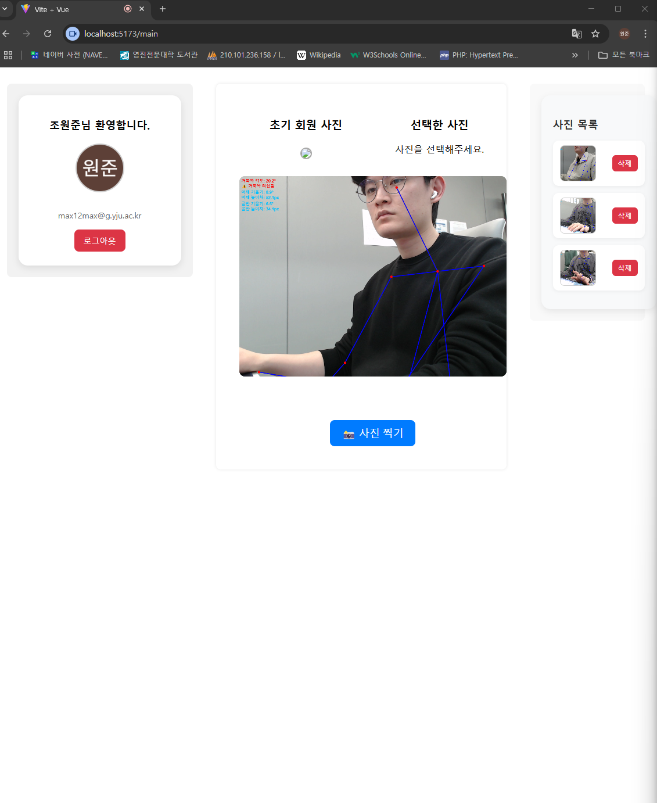

PostureCare - 姿勢分析ウェブアプリケーション

📸 カメラを活用して ストレートネック（猫背） および 肩の左右非対称 をリアルタイムで分析する、ウェブベースの姿勢測定ツールです。

🧠 紹介

PostureCare はカメラでユーザーの正面または側面の写真を撮影し、

ストレートネック（首の前傾）

肩の左右非対称

を分析できる、SPA（シングルページアプリケーション） ベースのウェブアプリケーションです。
Google OAuth による認証を通じてユーザーのみがアクセス可能で、測定結果は日付ごとに保存・閲覧できます。

⚙️ 使用技術

フロントエンド: Vue.js (SPA構成)

バックエンド: Express.js

データベース: MySQL

認証: Google OAuth 2.0

📌 主な機能

ウェブカメラまたはカメラを利用した姿勢撮影（正面・側面）

AIによる姿勢分析および結果の表示

ユーザー認証（Google OAuth）

分析結果の保存および日付別の閲覧機能

🎯 制作のきっかけ

勉強中に徐々に姿勢が悪くなっていることを実感し、
自分自身で姿勢を認識し、改善するためのツールが必要だと考え、開発しました。

🖼️ スクリーンショット

  

💡 今後の計画（任意）

リアルタイムストリーミングによる姿勢分析への拡張

モバイル環境への対応

姿勢改善ガイドの追加
