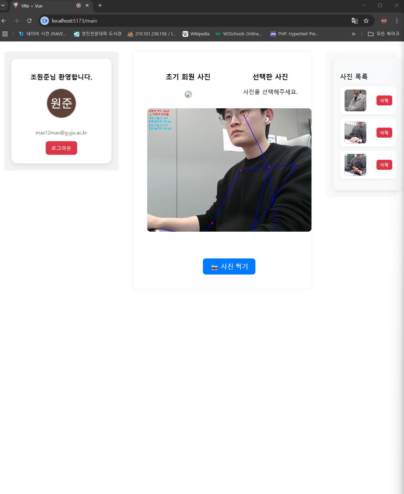

PostureCare
姿勢分析ウェブアプリケーション

カメラを活用し、ストレートネック（猫背）および肩の左右非対称をリアルタイムで分析する SPA ベースの姿勢測定ウェブアプリケーション。

1. プロジェクト概要

PostureCare は、ユーザーの正面または側面の姿勢をカメラで撮影し、

首の前傾（ストレートネック）

肩の左右バランス

を AI ベースで分析するウェブアプリケーションです。

単なる画像撮影ツールではなく、
「姿勢を数値として可視化し、記録・比較できるサービス」 を目指して設計しました。

Google OAuth 認証によりユーザーを識別し、
測定結果は日付ごとに保存・閲覧できます。

2. 制作背景

勉強や開発作業を続ける中で、姿勢が徐々に悪化していることを実感しました。

しかし、

自分の姿勢を客観的に確認する機会が少ない

数値で比較できるツールがない

継続的に記録できる仕組みがない

という課題がありました。

そこで、

「撮影 → 分析 → 保存 → 比較」

までを一貫して行えるウェブサービスとして実装しました。

3. 技術構成
Frontend

Vue.js（SPA構成）

単一ページ内で撮影・分析・履歴閲覧を実装

Backend

Express.js

REST API 設計

分析結果の保存ロジック実装

Database

MySQL

ユーザー情報および日付別測定データ管理

Authentication

Google OAuth 2.0

ユーザーごとのデータ分離

4. 主な機能

ウェブカメラによる姿勢撮影（正面 / 側面）

AI による姿勢分析

分析結果の数値表示

Google OAuth 認証

日付別履歴保存・閲覧機能

5. 工夫した点

SPA 構成によりページ遷移なしで測定から履歴確認まで完結

認証ベースでユーザーごとのデータを分離

単発分析ではなく「継続的に記録できる設計」

6. スクリーンショット

  

7. 今後の拡張予定

リアルタイムストリーミング分析への拡張

モバイル最適化

姿勢改善ガイド機能の追加

グラフによる変化の可視化
